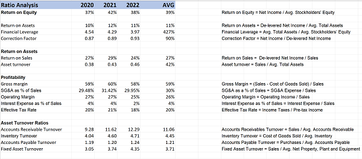
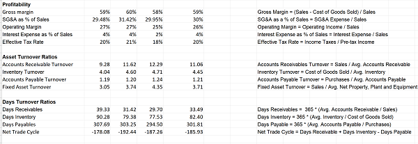
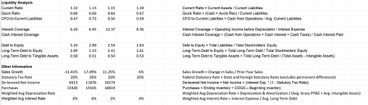

# Financial_statements_analysis

The project aims to conduct a comprehensive financial statement analysis using Microsoft Excel, focusing on profitability and turnover ratios to assess the company's performance. Additionally, the analysis will include an examination of the liquidity ratios to evaluate the company's financial stability. By compiling and analyzing these ratios, the project aims to provide insights into the company's financial health and facilitate the forecasting of future financial statements. Microsoft Excel will serve as the primary tool to organize, calculate, and interpret the financial data, enabling a thorough assessment of the company's financial performance.

## Highlights 

## Analysis Report

The provided data presents financial ratios and other relevant information for the years 2020, 2021, and 2022. Let's analyze the key findings and trends based on the given data.

### Profitability:

Return on Equity (ROE) shows a consistent performance, averaging at 39% over the three-year period. This indicates efficient utilization of shareholder equity.
Return on Assets (ROA) also demonstrates stable growth, averaging 11%. This suggests effective asset management and generating profits from the company's investments.

### Asset Turnover:

Return on Sales (ROS) indicates a positive trend, with an average of 27% over the three years. This reveals the company's ability to generate profits from its sales revenue.
Asset turnover shows an increasing trend, reaching an average of 0.42. This indicates improved efficiency in utilizing assets to generate revenue.
Profitability and Efficiency:

Gross margin remains consistent at 59%, indicating effective cost management and profitability of the company's products or services.
Operating margin shows stable performance, averaging 26% over the three-year period.
The effective tax rate remains steady at 20%, indicating consistent tax management.

### Asset Management:

Accounts Receivable Turnover demonstrates an increasing trend, reaching an average of 11.06. This suggests efficient management of credit sales and timely collection of receivables.
Inventory Turnover remains relatively stable, averaging 4.45, indicating efficient inventory management.
Accounts Payable Turnover shows consistent performance, averaging 1.21, indicating effective management of supplier payments.
Fixed Asset Turnover demonstrates an increasing trend, reaching an average of 3.71, suggesting improved efficiency in utilizing fixed assets.

### Liquidity:

The Current Ratio indicates a declining trend, averaging 1.20 over the three years. This may warrant attention to ensure the company's ability to meet short-term obligations.
The Quick Ratio remains relatively stable at 0.67, indicating the company's ability to cover short-term liabilities with its most liquid assets.
CFO-to-Current Liabilities shows a fluctuating trend, averaging 0.59, indicating variations in cash flow generation to meet short-term obligations.

### Debt and Solvency:

Debt to Equity ratio exhibits a declining trend, averaging 2.83 over the three-year period. This indicates improved solvency and reduced reliance on debt financing.
Long-Term Debt to Equity ratio also demonstrates a decreasing trend, averaging 1.61, indicating a declining reliance on long-term debt.
Other Information:

Sales Growth shows a positive trend, with an average growth rate of 6% over the three years.
The Statutory Tax Rate remains consistent at 20%, reflecting adherence to regulatory requirements.
Overall, the analysis of the provided data suggests that the company has maintained profitability, efficiently managed its assets, and demonstrated improved solvency over the three-year period. However, attention may be needed regarding liquidity measures, such as the declining Current Ratio. It would be beneficial to monitor and address any potential short-term liquidity challenges.

## Contributer

Amrita Prithiani

